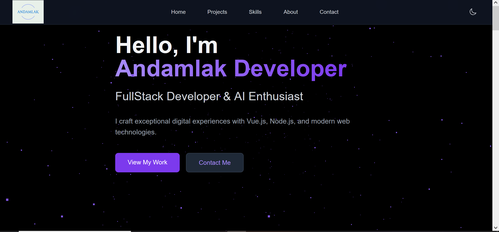

# Creative Portfolio

Welcome to my portfolio! This project highlights my work, skills, and creative journey as a developer.

## 🚀 Features

- Interactive 3D project showcases using Three.js
- Responsive design for all devices
- Clean, modern UI
- Smooth navigation

## 🛠️ Technologies Used

- HTML, CSS, JavaScript
- Vue.js
- Three.js

## 📂 Project Structure

```
/portfolio
    ├── public/
    ├── src/
    │   ├── components/
    │   ├── assets/
    │   └── App.vue
    └── README.md
```

## 📸 Screenshots



## ✨ Getting Started

1. Clone the repository:
    ```bash
    git clone https://github.com/andoabza/portfolio.git
    ```
2. Install dependencies:
    ```bash
    npm install
    ```
3. Start the development server:
    ```bash
    npm run serve
    ```

## 📬 Contact

Feel free to reach out via [your email] or connect on [LinkedIn/Twitter].

---
> “Creativity is intelligence having fun.” – Albert Einstein
